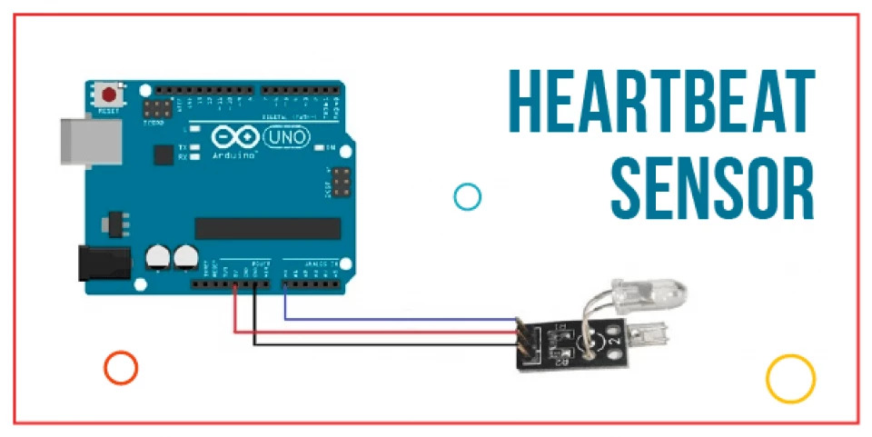

Components Required 

- Arduino UNO x 1 
- 16 x 2 LCD Display x 1 
- 10KΩ Potentiometer 
- 330Ω Resistor (Optional – for LCD backlight) 
- Push Button 
- Heartbeat Sensor Module with Probe (finger based) 
- Mini Breadboard 
- Connecting Wires 
